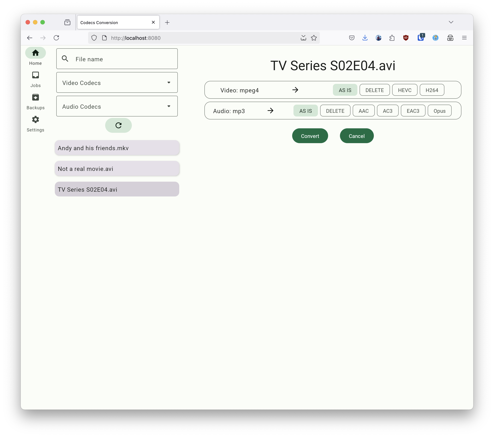
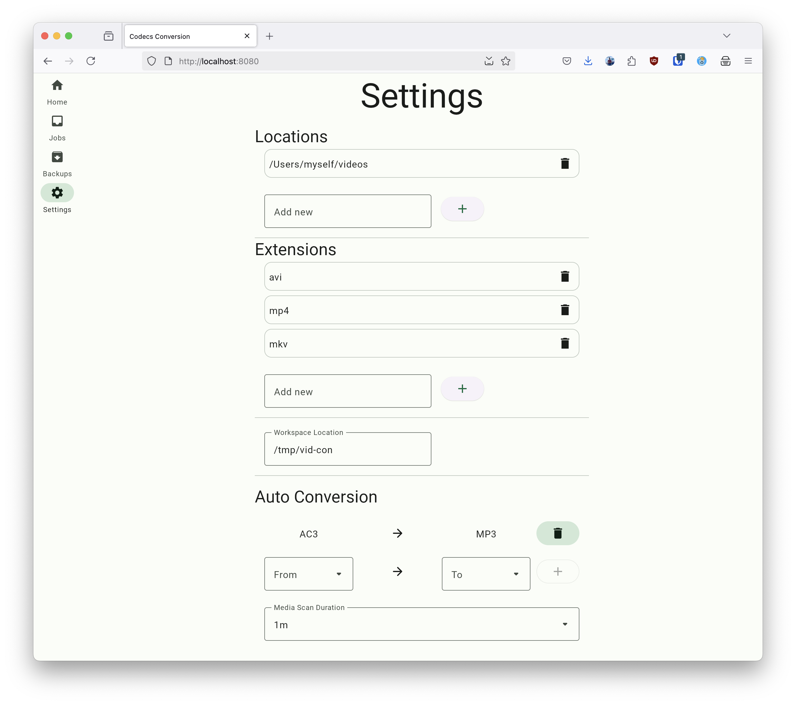

# CodeXvert - Manage and Transcode Your Video Library

CodeXvert is a modern web application built with Kotlin Multiplatform that simplifies managing and transcoding your video library. It provides a user-friendly interface to browse your videos, filter them by codecs, and convert between different video and audio codecs with ease.

## Features

- **Video Library Management**: Configure your library directory to search your video files and display the codec
  information.
- **Codec Filtering**: Filter your videos based on video and audio codecs for better organization and easy identification.
- **Transcoding**: Convert between different video and audio codecs with a simple interface. Supported codecs include
  H.264, H.265, AAC, MP3, Opus, AC3 and EAC3.
- **Background Monitoring**: Automatically monitor and manage your video library in the background, ensuring your
  library is always up-to-date.

## Getting Started

To get started with CodeXvert, you can either run the application locally or deploy the Docker container.

### Running Locally

1. Clone the repository: `git clone https://github.com/jsixface/codexvert.git`
2. Navigate to the project directory: `cd codexvert`
3. Build the project: `./gradlew build`
4. Run the web application: `./gradlew :server:run`
5. Access the application in your browser at `http://localhost:8080`

### Docker Deployment

CodeXvert is available as a Docker image on the GitHub Container Registry. You can pull and run the latest image with
the below command.

The indexed data about the files and their codecs are stored in `/app/data/codex.db`. This should be mounted if you like
the `ffprobe` parsing should be persisted.
```bash
docker run -d --rm \
  --name codexvert \
  -v ./data:/app/data \
  -v /media:/media \
  -p 8080:8080 \
  ghcr.io/jsixface/codexvert:latest
```

#### Compose

```yaml
 services:
     codexvert:
         container_name: codexvert
         image: ghcr.io/jsixface/codexvert:latest
         restart: unless-stopped
         ports:
             - 8080:8080
         volumes:
             - ./data:/app/data
             - /media:/media
             - /etc/localtime:/etc/localtime:ro
```
This will start the CodeXvert application and expose it on http://localhost:8080.

## Screenshots

[//]: # (![Video Files]&#40;docs/1_video_files.png&#41;)




## License

CodeXvert is released under the AGPL-3.0 License.

